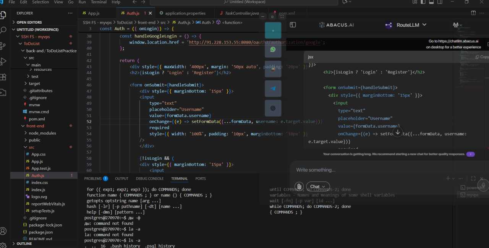

# About the Project

FireFlyApp was created based on PySide6 for users who have only one screen on their laptop. I often need to read instructions or reference materials without switching between windows using Alt+Tab. This application allows you to place web widgets on top of all windows, adjust their opacity, and quickly access the information you need without distracting from your main work.

# Features

- Add and remove web views
- Customizable view icons
- Frameless window with rounded corners
- Opacity and "always on top" toggle

## State Persistence

FireFlyApp uses cookies to save the application's state. Your settings and open pages are preserved, so after closing or restarting your PC, the app will start in the same state as you left it.

# Requirements

- Python 3.6+
- PySide6
- PyInstaller
- You can install the required packages using the provided `requirements.txt` file.

# Usage

Below are some screenshots demonstrating the main features and interface of FireFlyApp.

## Main Window
 </img>
 
## Opacity Setting
 </img>

## Opacity Button
 </img>

## Adding a New Page
 </img>